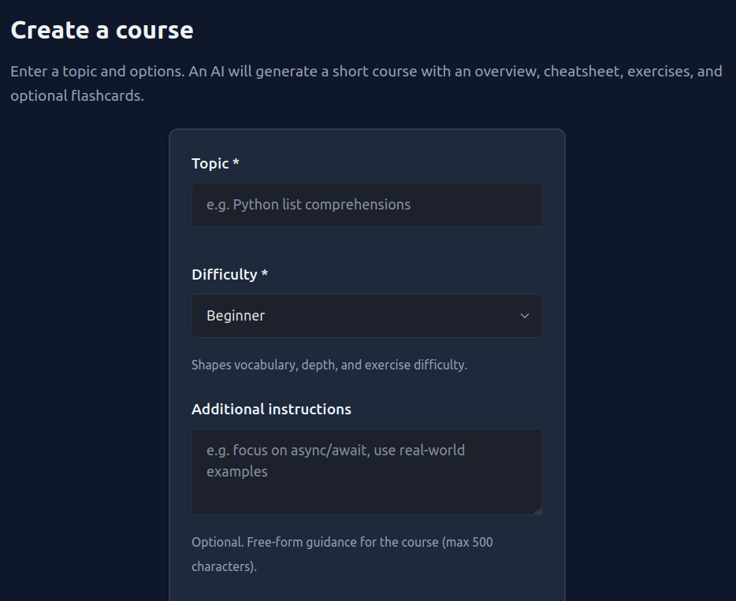
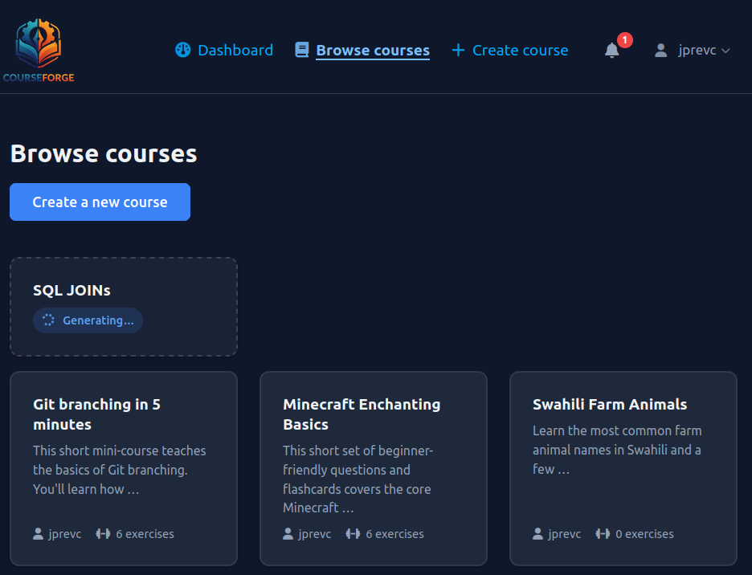
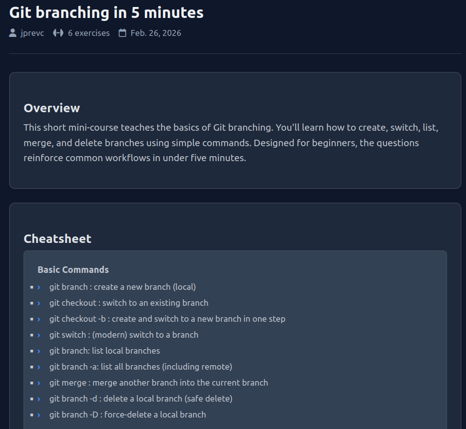
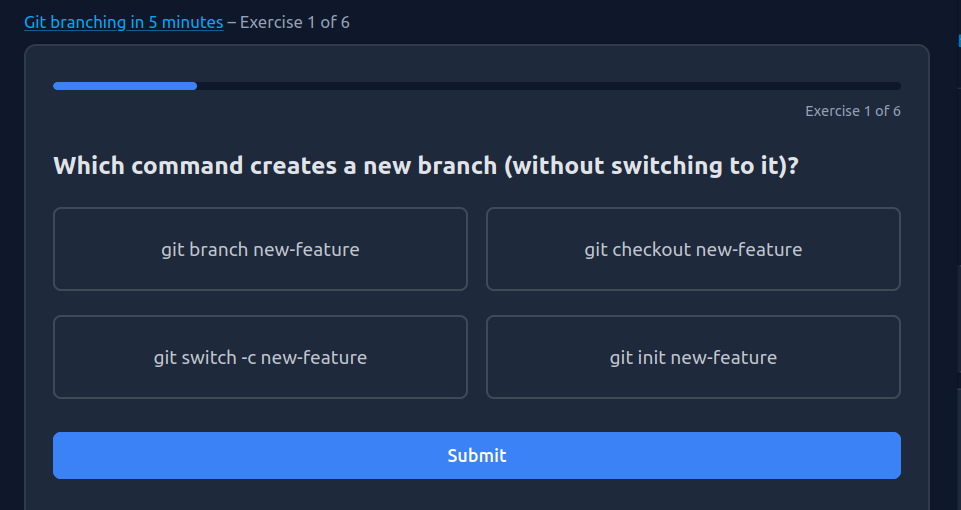

# CourseForge

[](https://github.com/jprevc/courseforge/actions/workflows/ci.yml)
[](https://www.python.org/downloads/)
[](https://opensource.org/licenses/MIT)

A learning platform where users create gamified courses on any topic. Courses are generated by an LLM agent (pydantic-ai) and stored so anyone can take them without re-generating.

## Features

- **User accounts**: Register, log in, dashboard
- **Create course**: Enter a topic; an AI generates an overview, cheatsheet, and 5–8 exercises (multiple choice and matching pairs)
- **Take courses**: Browse courses, start exercises, get feedback, track progress (X/Y completed)
- **Reuse**: Once created, a course can be used by any user

## Setup

1. **Install uv** (if not already installed)

   ```bash
   curl -LsSf https://astral.sh/uv/install.sh | sh
   ```

   Or see [uv installation docs](https://github.com/astral-sh/uv#installation).

2. **Install dependencies**

   ```bash
   uv sync
   ```

   This creates a virtualenv and installs all dependencies. Development tools (pytest, ruff, mypy, black) are in a separate dev group but are installed by default with `uv sync`.

3. **Environment**

   Copy `.env.example` to `.env` and set at least:

   - `OPENAI_API_KEY` – required for course generation (e.g. from OpenAI)

   For PostgreSQL (optional), set `PGHOST`, `PGUSER`, `PGPASSWORD`, `PGDATABASE`. If not set, the app uses SQLite.

4. **Database**

   ```bash
   uv run python manage.py migrate
   ```

5. **Run**

   ```bash
   uv run python manage.py runserver
   ```

   Open http://127.0.0.1:8000/

## Creating a course

1. Log in, then go to **Create course**.
2. Enter a topic (e.g. "Python list comprehensions").
3. Wait for the agent to generate the course (may take 10–30 seconds).
4. You are redirected to the course page; you can start exercises or share the link.

## Screenshots

| Course generation form                                                 | Browse courses                                         |
|------------------------------------------------------------------------|--------------------------------------------------------|
|  |  |
| Course overview                                                        | Exercise                                               |
|                |              |

## Tech stack

- **Backend**: Django 5.x
- **Database**: SQLite (default) or PostgreSQL
- **LLM agent**: pydantic-ai with structured output (Pydantic models)
- **Frontend**: Django templates, [PicoCSS 2](https://picocss.com/) (`@picocss/pico@2`)

## Architecture

Course creation is **asynchronous** so the UI stays responsive while the LLM runs (10–30 seconds):

1. **Submit** - User submits the topic; the server creates a `CourseGenerationJob` (status `pending`) and starts a **background thread** that calls the pydantic-ai agent.
2. **Polling** - The user is redirected to the course list. Pending jobs are shown as “Generating…” cards; the page **polls** `GET /courses/api/job-status/<job_id>/` every few seconds.
3. **Completion** - When the thread finishes, the job status becomes `complete` or `failed`, the `Course` is attached to the job, and a **Notification** is created (“Your course X is ready!” or an error message). The polling client sees the update and refreshes the list (or removes the card on failure).

## Project structure

- `courseforge/` – Django project settings and URLs
- `users/` – Auth (register, login, dashboard)
- `courses/` – Course and Exercise models, create/detail/list/start/exercise views
- `progress/` – UserProgress (per-attempt records)
- `agent/` – pydantic-ai course generator (CourseContent model, agent, `run_course_gen.py`)

## Docker

For local or deployment-style runs with PostgreSQL:

```bash
docker compose up -d
docker compose exec web python manage.py migrate
docker compose exec web python manage.py createsuperuser  # optional
```

Then open http://localhost:8000. The `web` service uses `.env` for secrets (e.g. `OPENAI_API_KEY`, `COURSEFORGE_LLM_MODEL`); the compose file sets `PGHOST`, `PGDATABASE`, etc. for the Postgres service. **Note:** The default `POSTGRES_PASSWORD` in `docker-compose.yml` is for local use only-use a strong password and proper secrets in production.

## Tests

```bash
uv run pytest
```

Runs tests with pytest (see `pyproject.toml` for pytest-django config). The agent build test is skipped unless `OPENAI_API_KEY` is set.

## Development

- **Lint:** `uv run ruff check .`
- **Format:** `uv run black .`
- **Type check:** `uv run mypy .`

CI runs on push/PR to `main` (lint, format check, mypy, pytest). See [.github/workflows/ci.yml](.github/workflows/ci.yml).
